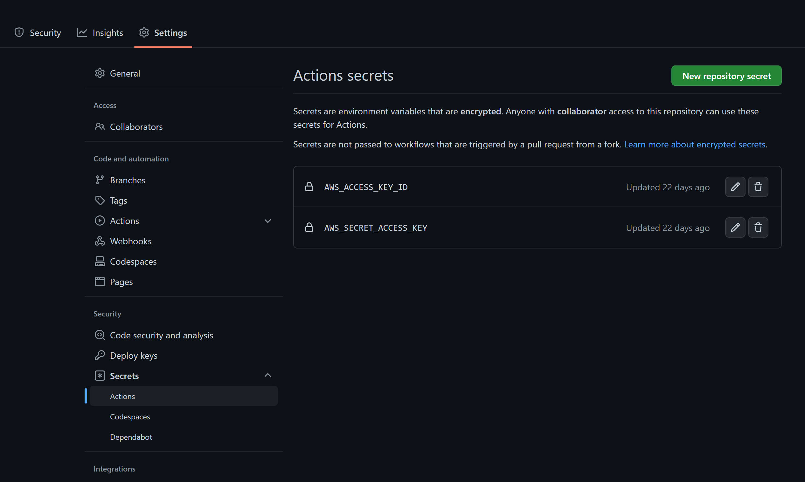

# Models on Cloud
A template for empowering business users with machine learning models by connecting your spreadsheet to ML models.

## Table of Content
<!-- TOC -->
* [Models on Cloud](#models-on-cloud)
  * [Table of Content](#table-of-content)
  * [How to Use This Template](#how-to-use-this-template)
    * [Setup](#setup)
      * [Windows](#windows)
      * [macOS/Linux](#macoslinux)
    * [Configure AWS Account](#configure-aws-account)
    * [First Time Deploy](#first-time-deploy)
    * [Use the Delivery File](#use-the-delivery-file)
    * [To Update Model After Deployment, Automated with GitHub Actions](#to-update-model-after-deployment-automated-with-github-actions)
  * [Architecture](#architecture)
<!-- TOC -->

## How to Use This Template
### Setup
#### Windows
1. Clone this repo, run PowerShell as Administrator and open its location
2. Run `iex setup\windows.ps1` in PowerShell. This is going to
   install [chocolatey](https://chocolatey.org/), [AWS CLI](https://aws.amazon.com/cli/), [AWS SAM](https://aws.amazon.com/serverless/sam/),
   and [Docker Desktop](https://www.docker.com/products/docker-desktop/)
#### macOS/Linux
1. Install AWS CLI from [here](https://aws.amazon.com/cli/)
2. Install AWS SAM
   from [here](https://docs.aws.amazon.com/serverless-application-model/latest/developerguide/install-sam-cli.html)
3. Install Docker from [here](https://www.docker.com/get-started)

### Configure AWS Account
1. Reboot your computer after the Setup finished
2. Have a AWS account ready, create
   an [IAM user account](https://us-east-1.console.aws.amazon.com/iamv2/home?region=us-east-1#/users) with Access Key
3. Run `aws configure` in your terminal of choice (could be PowerShell on Windows), and when prompted, input:
   - `AWS Access Key ID`: the AWS Access Key ID for the IAM user you created
   - `AWS Secret Access Key`: the AWS Access Key Secret for the IAM user you created
   - `Default region name`: `us-east-1`
   - `Default output format`: `json`

### First Time Deploy
1. Clone this repo
2. Develop your model in `model/train.ipynb` and use the last cell to save it to `model/model.pkl`. The model object
   needs to implement `run_predict` method and `input_columns` attribute, as specified in `predict/utils.py/Model` class.
3. Move your model file to `predict/model.pkl`
4. Add your python dependencies to `predict/requirements.txt`. If you have any system dependencies, add them to
   `predict/Dockerfile` (line 43)
5. Run `sam build` in terminal at project root to build the project. You can then locally test it with `sam local start-api`
6. Run `sam deploy --guided` in terminal at project root to deploy the project to AWS. You will be asked to provide a stack name, AWS region. You
   can use the default values for other options. When asked for `Save arguments to configuration file`, answer yes to
   generate a `samconfig.toml` file at root. Commit that toml file and push to your repo
7. Get the API endpoint from the output printed in terminal. It will be something like
   `https://<random_string>.execute-api.<region>.amazonaws.com/Prod/`
8. Copy the API endpoint and paste it in `deliverables/delivery.xlsm` at sheet `Config` cell `C2`

### Use the Delivery File
1. Open `deliverables/delivery.xlsm` in Excel, make sure sheet `Config` cell `C2` is filled with correct API endpoint.
2. Put your input data in `INPUT_TABLE` table at sheet `Input`. Column names need to be exactly the same as what the
   model takes.
3. Find `Queries & Connections` button at `Data` tab and click it. This will open the side panel.
4. Right click `Query Prediction API` and click `Load To...`. Usually you want to create a table for the output.

### To Update Model After Deployment, Automated with GitHub Actions
1. Create a repo on GitHub, go to repo - Settings - Secrets - Actions, use `New repository secret` button to add your
   AWS access id and key as `AWS_ACCESS_KEY_ID` and `AWS_SECRET_ACCESS_KEY`. 
2. Change the branch name at line 4 of `./github/workflows/sam-pipeline.yaml` to your production branch name. Usually
   this is `master` or `main`, and sometimes people use `develop` as production branch as well.
3. Use `model/train.ipynb` to train the new model, use the last cell to dump the new model file, replace the old model
   file in `predict` with the new one.
4. Make sure `samconfig.toml` file from the initial deployment exists at project root, commit and push everything to the
   production branch on GitHub, it will be deployed to AWS automatically.

## Architecture

